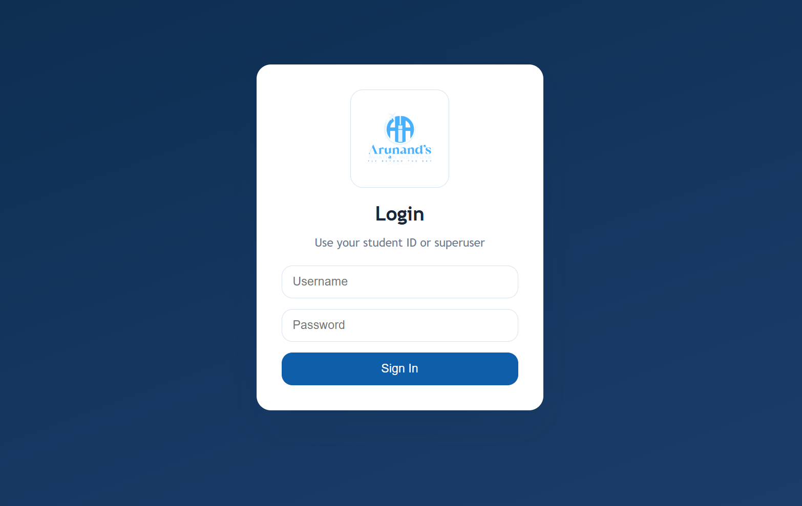
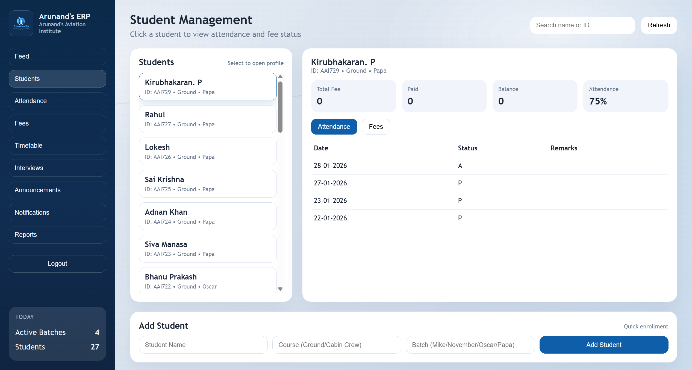
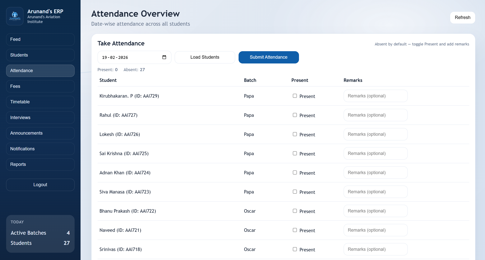
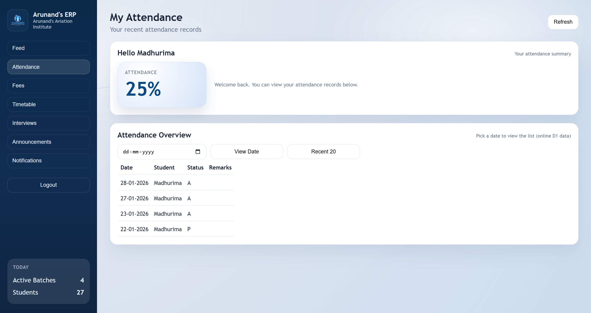

# Student ERP

<p align="center">
  <b>Aviation training management system for small institutes</b><br/>
  Attendance, fees, role-based access, and Excel sync in one app.
</p>

<p align="center">
  
  
  
  
</p>

## What Is This?

Student ERP is a local-first web app for managing students in an aviation training workflow.

It helps you:
- track attendance daily,
- record fee payments with receipts,
- separate superuser and student views,
- sync attendance from an Excel source file.

## Who Is It For?

- Training institutes that want a lightweight internal tool.
- Teams that currently maintain attendance in Excel but need a web dashboard.

## Main Features

- Role-based login:
  - `superuser` can manage everyone.
  - Students can see only their own data.
- Attendance:
  - Mark attendance from the web UI.
  - Date-wise attendance view.
  - Sync attendance from `attendance_master.xlsm`.
- Fees:
  - Record payments per student.
  - Upload receipt files (`png`, `pdf`, and other file types).
  - Student-facing remaining balance view.
- Session handling:
  - Session expires after 5 minutes of inactivity.
  - Refresh keeps your current tab while session is valid.

## Quick Start

### 1. Install dependencies

```bash
pip install fastapi uvicorn pandas openpyxl python-multipart
```

### 2. Start backend

```bash
uvicorn backend.main:app --reload
```

### 3. Open frontend

Open:
- `frontend/index.html`

Backend URL used by frontend:
- `http://127.0.0.1:8000`

## Default Login (Local Demo)

- Superuser:
  - Username: `superuser`
  - Password: `qwerty`
- Students:
  - Username: student ID
  - Password: generated in `passwords.txt` (local file, gitignored)

## Project Structure

```text
aviation_erp/
|- backend/
|  |- main.py
|  |- db.py
|  |- schema.sql
|  |- import_attendance_excel.py
|  |- erp.db              # local runtime DB (gitignored)
|  `- receipts/           # uploaded receipts (gitignored)
|- frontend/
|  |- index.html
|  |- style.css
|  `- app.js
|- attendance_master.xlsm
|- passwords.txt          # generated local credentials (gitignored)
|- .gitignore
`- README.md
```

## API Snapshot

- `POST /login`
- `GET /auth/me`
- `GET /students`
- `POST /students`
- `GET /students/{student_id}/balance`
- `GET /students/{student_id}/attendance`
- `GET /students/{student_id}/fees`
- `GET /attendance/recent`
- `GET /attendance/by-date`
- `POST /attendance/record`
- `POST /attendance/sync`
- `POST /fees/record`
- `GET /fees/recent`
- `GET /reports/summary`

## Attendance and Excel Behavior

- Attendance recorded in UI is saved to:
  - `backend/erp.db`
  - `attendance_master.xlsm`
- Excel format used:
  - date: `dd-mm-yyyy`
  - status: `P` or `A`
- `Sync From Excel` reloads attendance from Excel into the DB.

## Screenshots

Add images to:
- `docs/screenshots/login.png`
- `docs/screenshots/superuser-dashboard.png`
- `docs/screenshots/attendance-tab.png`
- `docs/screenshots/student-view.png`

Then render them in README:

```md
### Login


### Superuser Dashboard


### Attendance Tab


### Student View

```

## Production Notes

Current auth/session setup is suitable for local/internal usage. For production:
- hash passwords (`bcrypt`),
- use a stronger session strategy (JWT or persistent session store),
- tighten CORS policy,
- enforce HTTPS and secure cookie handling.
