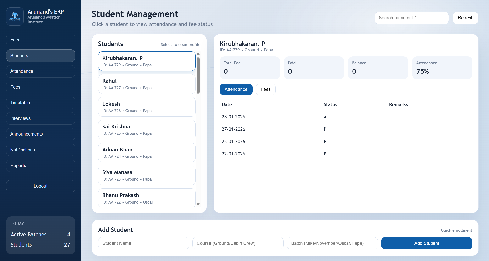
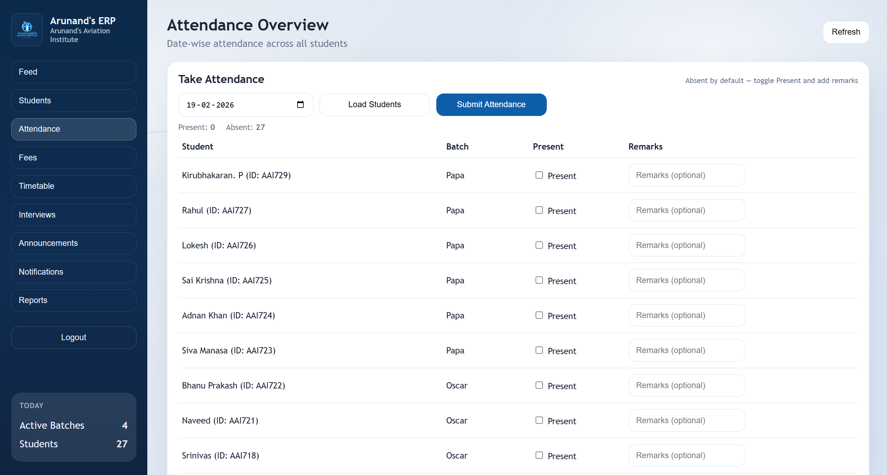
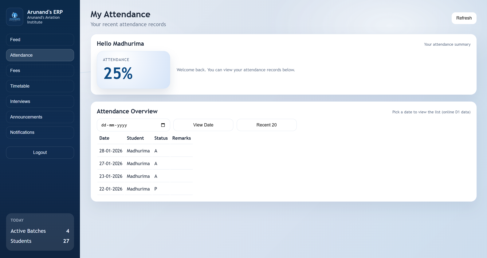

# Student ERP

<p align="center">
  <b>Aviation training management system for small institutes</b><br/>
  Attendance, fees, role-based access, and Excel sync in one app.
</p>

<p align="center">
  
  
  
  
</p>

## Live URL

- https://student-erp.pages.dev

## What Is This?

Student ERP is a local-first web app for managing students in an aviation training workflow.

It helps you:
- track attendance daily,
- record fee payments with receipts,
- separate superuser and student views,
- sync attendance from an Excel source file.

## Who Is It For?

- Training institutes that want a lightweight internal tool.
- Teams that currently maintain attendance in Excel but need a web dashboard.

## Main Features

- Role-based login:
  - Students can see only their own data.
- Attendance:
  - Mark attendance from the web UI.
  - Date-wise attendance view.
  - Sync attendance from `attendance_master.xlsm`.
- Fees:
  - Record payments per student.
  - Upload receipt files (`png`, `pdf`, and other file types).
  - Student-facing remaining balance view.
  - Student Razorpay payment flow with post-payment invoice PDF download.
  - Staff can generate invoice PDF from fee entries in portal.
- Session handling:
  - Session expires after 5 minutes of inactivity.
  - Refresh keeps your current tab while session is valid.

## Quick Start

### 1. Install dependencies

```bash
pip install -r requirements.txt
```

For development and tests:

```bash
pip install -r requirements-dev.txt
```

### 2. Start backend

```bash
uvicorn backend.main:app --reload
```

### 3. Open frontend

Open:
- `frontend/index.html`

Backend URL used by frontend:
- `http://127.0.0.1:8000`

## Default Login (Local Demo)

- Students:
  - Username: student ID
  - Password: generated in `passwords.txt` (local file, gitignored)

## Project Structure

```text
aviation_erp/
|- backend/
|  |- main.py
|  |- db.py
|  |- schema.sql
|  |- import_attendance_excel.py
|  |- erp.db              # local runtime DB (gitignored)
|  `- receipts/           # uploaded receipts (gitignored)
|- frontend/
|  |- index.html
|  |- style.css
|  `- app.js
|- attendance_master.xlsm
|- passwords.txt          # generated local credentials (gitignored)
|- .gitignore
`- README.md
```

## API Snapshot

- `POST /login`
- `GET /auth/me`
- `GET /students`
- `POST /students`
- `GET /students/{student_id}/balance`
- `GET /students/{student_id}/attendance`
- `GET /students/{student_id}/fees`
- `GET /attendance/recent`
- `GET /attendance/by-date`
- `POST /attendance/record`
- `POST /attendance/sync`
- `POST /fees/record`
- `GET /fees/recent`
- `GET /fees/{fee_id}/invoice`
- `GET /payments/gateway-status`
- `POST /payments/razorpay/order`
- `POST /payments/razorpay/verify`
- `GET /reports/summary`

## Tests

Run backend tests with:

```bash
pytest -q
```

## Attendance and Excel Behavior

- Attendance recorded in UI is saved to:
  - `backend/erp.db`
  - `attendance_master.xlsm`
- Excel format used:
  - date: `dd-mm-yyyy`
  - status: `P` or `A`
- `Sync From Excel` reloads attendance from Excel into the DB.

## Screenshots

### Login


### Superuser Dashboard


### Attendance Tab


### Student View


## Production Notes

Current auth/session setup is suitable for local/internal usage. For production:
- hash passwords (`bcrypt`),
- use a stronger session strategy (JWT or persistent session store),
- tighten CORS policy,
- enforce HTTPS and secure cookie handling.

## Cloudflare Pages Deployment (Free Tier)

This repo now includes:
- Pages Functions API: `functions/api/[[path]].js`
- D1 migration: `migrations/0001_init.sql`
- Wrangler config: `wrangler.toml`

### 1. Install and login

```bash
npm install -g wrangler
wrangler login
```

### 2. Create D1 and R2

```bash
wrangler d1 create student-erp-db
wrangler r2 bucket create student-erp-files
```

Update `wrangler.toml`:
- set `database_id` from D1 create output
- keep `binding = "DB"` and `binding = "ERP_FILES"`

### 3. Apply schema migration

```bash
wrangler d1 migrations apply student-erp-db
```

### 4. Set Razorpay secrets (optional but required for payments)

```bash
wrangler pages secret put RAZORPAY_KEY_ID --project-name student-erp
wrangler pages secret put RAZORPAY_KEY_SECRET --project-name student-erp
```

Important:
- secret names must be exactly `RAZORPAY_KEY_ID` and `RAZORPAY_KEY_SECRET`
- add them to the **Production** environment in Pages
- redeploy after updating secrets

### 5. Deploy

```bash
wrangler pages deploy frontend --project-name student-erp
```

After deploy:
- frontend is served from Pages
- API available at `/api/*` via Functions
- storage uses D1 + R2
- student payments show `Razorpay ready` only when both secrets are configured

### Local Razorpay setup (developer machine)

- For FastAPI local run, create `backend/.env`:

```bash
RAZORPAY_KEY_ID=...
RAZORPAY_KEY_SECRET=...
```

- For `wrangler pages dev`, create `.dev.vars`:

```bash
RAZORPAY_KEY_ID=...
RAZORPAY_KEY_SECRET=...
SESSION_TIMEOUT_SECONDS=300
```

Both files are local-only and gitignored.

### Attendance import on Cloudflare

- In Attendance tab, use `Sync From Excel` with a file selected.
- Parser currently supports `CSV` for automatic import.
- `.xlsx` / `.xlsm` files are uploaded to R2 but not parsed automatically.
- Recommended flow:
  1. Export `attendance_master.xlsm` sheet to CSV
  2. Upload CSV in the Attendance section
  3. Click `Sync From Excel`
